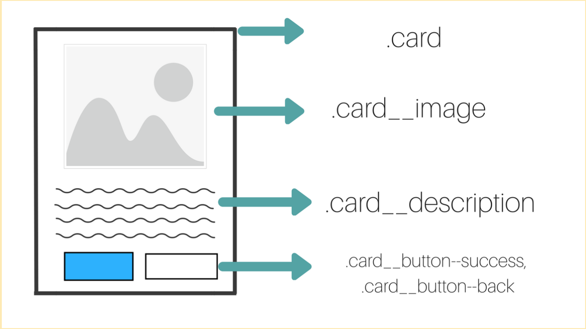

O que são pré-processadores ?

    Pré-processadores são programas que permitem gerar CSS a partir de determinada sintaxe.
    Existem diversos pré-processadores, sendo que a maioria deles permite adicionar funções
    que não são possíveis em CSS puro, como mixins, nesting, seletores, herança, etc.
    É possível usar a própria sintaxe CSS mas também podemos escrever a folha de estilo
    com algumas particularidades, como não usar chaves e colocar elementos dentro um do outro,
    criando o nesting. Essas funções facilitam a manutenção e aumentam a legibilidade do CSS.

    Os principais pré-processadores são Sass, Less e Stylus, mas existem outros menores também.
    Todos eles fazem coisas similares, com algumas particularidades e uma sintaxe própria.
    Neste curso estamos usando o Sass, um dos mais populares e também o mais antigo, criado em 2006.
    Sass significa Syntactically Awesome Style Sheets, e foi escrito em Ruby.
    O segundo pré-processador mencionado é o LESS, que foi criado 3 anos depois do Sass, em 2009,
    inspirado pelo mesmo, e foi escrito em JavaScript. E o último pré-processador
    mencionado é o Stylus, que foi lançado logo após o Less, em 2010, influenciado pelos dois anteriores,
    foi escrito em Node.js e combina características do Sass e do Less.

O que é o Sass ?

    Sass é um pré-processador CSS, que permite adicionar funções que não são possíveis no CSS puro.
    As principais vantagens de usar o Sass são a facilidade na escrita e sintaxe, e a possibilidade
    de adicionar funções, mixins, nestings, seletores e herança.

Nesting (Agrupamento) e Parent Selector (&).

    Exemplificando:

    Com o agrupamento do Sass, colocar um seletor dentro do outro é como aumentar a especificidade do css.
    O Parent Selector(&) serve para utilizar o nome mais a cima sem precisar ficar reescrevendo tudo.

    ```scss
        .header {
        font-family: Arial, Helvetica, sans-serif;

            &__logo {
                text-align: center;
            }

        }
    ```

    ```css
        .header {
            font-family: Arial, Helvetica, sans-serif;
        }
                
        .header__logo {
            text-align: center;
        }
    ```

Placeholder Selector (%) e Extend: 

Arquitetura de CSS - BEM:

    CSS é simples de se aprender e complexo de ser mantido. Conforme um projeto cresce, a manutenção do CSS vai ficando cada vez mais difícil, e para isso foram surgindo soluções, e o BEM é uma delas. BEM é um padrão de nomenclatura para manter o projeto simples e organizado. Ele foi criado pela Yandex e tenta resolver o problema de nomenclatura e estrutura do CSS permitindo facilitar e escalar o código, de forma que qualquer desenvolvedor tenha autonomia para mexer em qualquer projeto. A sigla BEM significa Block Element Modifier, em português, Bloco, Elemento, Modificador. Esses três pilares são a base dessa metodologia, e também as categorias em que os elementos são divididos.

    Vamos supor que você queira construir um componente de card. Nesse caso, o bloco seria o .card. E qualquer outra seção dentro do card seriam elementos. No exemplo, temos uma imagem, uma descrição e um botão. A convenção da nomenclatura do BEM conecta o bloco ao elemento com dois underlines, por exemplo .card__image. Ainda na nossa imagem, nós temos dois tipos de botões, eles seriam os modificadores, e nesse caso para a nomenclatura nós conectamos ao elemento com dois hífens, por exemplo .card__button--success e .card__button--back.

 

    Mas como saber o que é um elemento e o que é um modificador?

    Um elemento sempre será uma parte da estrutura do bloco, já os modificadores são estados que os nossos blocos ou elementos poderão ter, como botões com diferentes aparências ou uma situação de destaque.

    Prós e contras:

    BEM deixa o nosso CSS com uma estrutura modular. Por conta dos nomes únicos, não acontecerão conflitos entre as classes, o que facilita a manutenção. Porém, às vezes, os nomes das classes ficam muito compridos ao se usar a metodologia, mas com o uso de um pré-processador (como estamos usando no curso), isso não será um grande problema (pois usaremos o nesting).

At Rules:

    Grande parte das funções extras do Sass vem no formato de At rules, e nesta aula vimos alguns exemplos como mixins, function, import, extend e include, mas existem diversas At Rules:

        @use: carrega mixins, functions e variáveis de outras folhas de estilos Sass e combina o CSS de diversas folhas de estilo juntos.

        @forward: carrega uma folha de estilo Sass e torna os mixins, functions e variáveis disponíveis quando a folha de estilo é carregada pela regra do @use.

        @import: estende as regras de CSS para carregar styles, mixins, functions e variáveis de outras folhas de estilo.

        @mixins e @include: facilitam a reutilização de trechos de código.

        @function: define funções customizadas que podem ser utilizadas em expressões.

        @extend: permite que os seletores herdem estilos uns dos outros.

        @at-root: coloca estilos dentro dele na raiz do documento CSS.

        @error: faz com que a compilação falhe com uma mensagem de erro.

        @warn: imprime um aviso sem parar totalmente a compilação.

        @debug: imprime uma mensagem para fins de debugging.

        E também fluxos de controle, como: @if, @each, @for e @while.


Como criar um placeholder selector e como usá-lo com extend.
O Placeholder Selector é um tipo especial de seletor que é bem parecido com um seletor convencional mas com um % na frente e ele também não é exibido no arquivo CSS após ser compilado.
O que são os mixins.
Mixins permitem definir estilos que podem ser reutilizados, e isso evita o uso de classes repetitivas e não semânticas como .float-left, e também distribui coleções de estilo para bibliotecas.
Como deixar o site responsivo usando media queries com mixins.
Os media queries já são usados no CSS convencional, porém, com os mixins, é possível setar seus valores em apenas um lugar e reutilizá-lo em todo o código e, caso seja necessário, a alteração dos valores será feita em apenas um lugar.
Como criar funções no Sass.
As funções no Sass permitem definir operações complexas que podem ser reutilizadas em todo o projeto, facilitando abstração de comportamentos em comum.
Como importar arquivos no Sass.
Vimos como abstrair o nosso CSS, deixando ele separado para cada uma das páginas. Dessa maneira a manutenção fica mais fácil e, para os CSS abstraídos funcionarem, nós usamos o @import, que importa os arquivos dentro de um principal

Comando para compilar e transformar o scss em css:

    sass ./assets/styles/scss/style.scss:./assets/styles/css/style.css

    Pra não ficar toda hora tendo que rodar esse comando podemos usar o parâmetro --watch
    para que seja detectada toda alteração

    sass --watch ./assets/styles/scss/style.scss:./assets/styles/css/style.css
